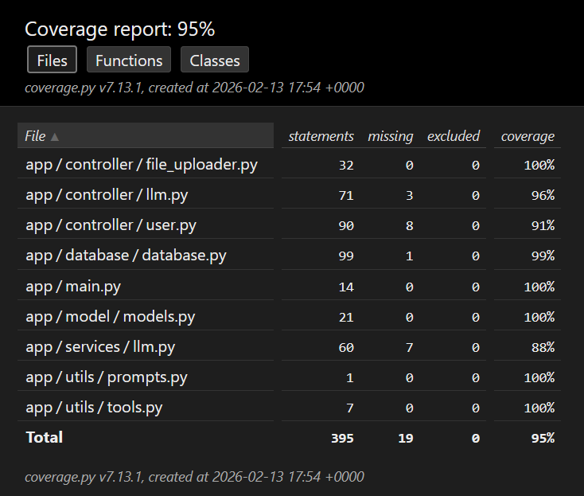

# FAQChatbot


[](./LICENSE)

## 💬 FAQ Chatbot
This is a Chatbot created with Neo4J and Retrieval-Augmented Generation (RAG) to answer technical questions based on official documentation. The project leverages graph databases to maintain relationships between document chunks, providing more contextually aware answers.

## 🚀 Key Features
-   **Graph-Enhanced RAG**: Utilizes Neo4j to store document chunks and their semantic relationships, improving retrieval accuracy.
-   **Persistent Conversation History**: All message histories are stored directly in Neo4j, allowing the chatbot to maintain context across sessions and provide consistent, personalized interactions.
-   **Flexible Inquiry**: Supports both RAG-based answers (using documentation context) and direct LLM responses.

## 🛠️ Which technologies were used?
- This project was built using:
    - **FastAPI**: Modern, fast (high-performance) web framework for building APIs.
    - **Neo4j**: Graph database for storing document embeddings, relationships, and conversation history.
    - **LangChain**: Framework for developing applications powered by large language models.
    - **Groq**: High-speed inference engine for LLMs (Llama 3.3).
    - **HuggingFace**: For generating high-quality vector embeddings.
    - **Poetry**: Dependency management and packaging.

## 🧠 How does it work?

### Graph Architecture
1.  **Ingestion**: Documents are chunked and transformed into nodes in Neo4j.
2.  **Contextual Mapping**: Relationships  are created between chunks to form a Knowledge Graph.
3.  **RAG Process**: When a query is received, the system retrieves the most relevant nodes and their neighbors from the graph to provide rich context to the LLM.

### Message History
Every conversation is linked to a `User` node and a `Session` node in Neo4j. Messages are stored as `Message` nodes, ensuring that the full context of a conversation is always available for the LLM during the generation phase.

---

## ⚙️ Getting Started

### 1. Environment Variables
Duplicate the `.env.sample` to a new file named `.env` and configure the following:

| Variable | Description |
| :--- | :--- |
| **PYTHONPATH** | Set to `.` |
| **NEO4J_URI** | Neo4j instance URI (Bolt or Aura) |
| **NEO4J_USERNAME** | Database username (default: `neo4j`) |
| **NEO4J_PASSWORD** | Database password |
| **NEO4J_DATABASE** | Database name (default: `neo4j`) |
| **GROQ_API_KEY** | Your [Groq API Key](https://console.groq.com/keys) |
| **GROQ_MODEL** | LLM model (e.g., `llama-3.3-70b-versatile`) |
| **HUGGINGFACEHUB_API_TOKEN** | Your HuggingFace token |
| **HUGGINGFACE_EMBEDDER_MODEL** | Embedding model name (default: `sentence-transformers/all-MiniLM-L6-v2`) |
| **VECTOR_DIMENSIONS** | Dimension size for embeddings (default: `384`). **Note**: This value must match the specific output dimension of the embedder model used. |
| **SECRET_KEY** | Generated with `openssl rand -hex 32` |
| **ALGORITHM** | Encryption algorithm (default: `HS256`) |
| **ACCESS_TOKEN_EXPIRE_MINUTES** | Token validity in minutes |

### 2. Installation (Local)
```bash
# Install Poetry if you don't have it
pip install poetry

# Install dependencies
poetry install

# Start the server
poetry run uvicorn app.main:app --host 0.0.0.0 --port 8000 --reload
```

### 3. Running with Docker
```bash
# Build the image
docker build --pull --rm -f "Dockerfile" -t faq_chatbot:latest "."

# Run the container
docker run -dti -p 8000:8000 --env-file .env --name faq_chatbot_instance faq_chatbot
```

---

## 📖 Usage Guide

### 🔐 Authentication & Authorization
Most endpoints require a Bearer Token. 
1.  **Get Token**: Send a POST request to `/user/token` with your credentials.
2.  **Use Token**: Include the token in the header of subsequent requests:  
    `Authorization: Bearer <your_access_token>`

### 🔄 Order of Execution
To fully utilize the chatbot, follow this sequence:
1.  **Create User**: `POST /user/` - Initialize your account.
2.  **Authorize**: `POST /user/token` - Receive your Bearer Token.
3.  **Upload Knowledge**: `POST /files/` - Upload PDF documentation to the graph.
4.  **Ask Questions**:
    - **With RAG**: `POST /llm/rag/` - Get answers based on uploaded documentation.
    - **Direct LLM**: `POST /llm/` - Get general answers from the LLM.

### 💻 Endpoint Examples

#### Uploading a File
```bash
curl -X POST "http://localhost:8000/files/" \
     -H "Authorization: Bearer <TOKEN>" \
     -H "Content-Type: multipart/form-data" \
     -F "file=@document.pdf" \
     -F "document_subject=Technical Docs" \
     -F "file_name=guide.pdf"
```

#### Asking a RAG Question
```json
// POST http://localhost:8000/llm/rag/
{
  "text": "How do I configure the graph?",
  "session_id": "optional-uuid"
}
```

### 🛠️ Interactive Documentation
For a full list of endpoints and interactive testing, visit the Swagger UI when running in your local machine:  
[http://localhost:8000/docs](http://localhost:8000/docs)

---

## 🧪 Tests Coverage
Below is the coverage report from the latest test execution:

<div align="center">
  
</div>

---

### Running Tests with Docker
To execute the tests and generate a fresh coverage report using Docker, run the following command:

```bash
docker build --pull --rm -f Dockerfile -t faq:latest . && \
docker run --rm \
  -v "$(pwd):/workspace" \
  --env-file .env \
  faq:latest \
  sh -c "poetry run pytest . --cov=app --cov-report=html:/workspace/htmlcov --delay 15"
```

> [!NOTE]
> The `--delay 15` flag is necessary if you are using the **Groq Free Tier**. This delay ensures that the requests stay within the rate limits imposed by the free tier during the test suite execution.

## 📄 License
This project is licensed under the [Apache 2.0 License](./LICENSE).
